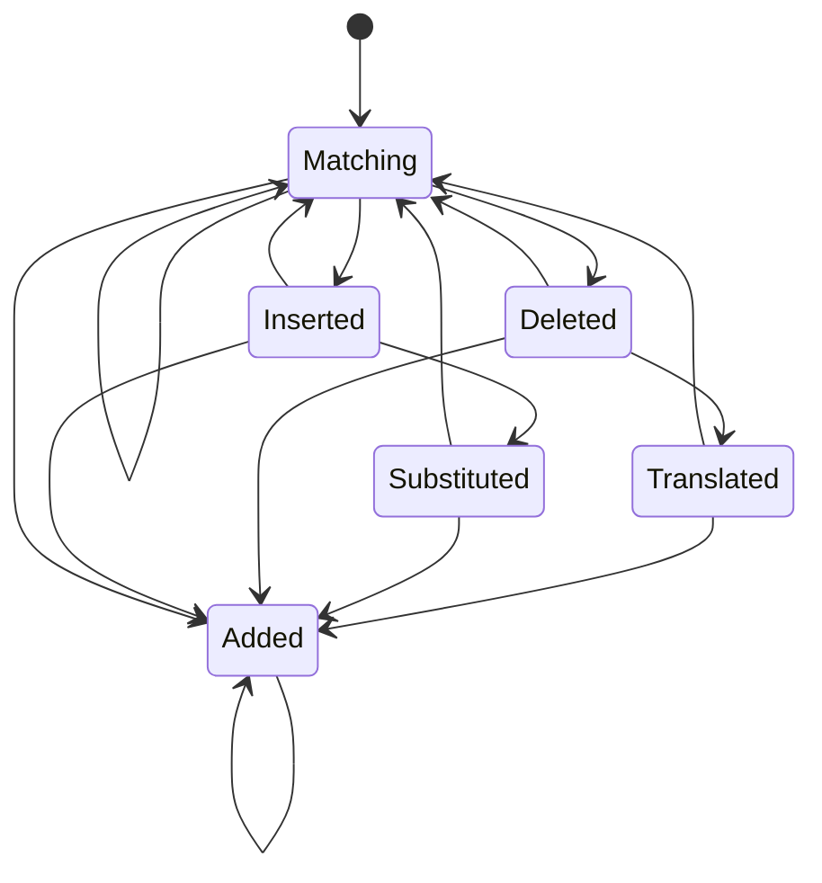

- [Edit State](#edit-state)
  - [State chart](#state-chart)
- [Example - `s`earched=`some`](#example---searchedsome)
  - [Equals - `f`ound=`some`](#equals---foundsome)
  - [Delete - `f`ound=`sme`](#delete---foundsme)
  - [Translate - `f`ound=`smoe`](#translate---foundsmoe)
  - [Insert - `f`ound=`sotme`](#insert---foundsotme)
  - [Substitute - `f`ound=`stme`](#substitute---foundstme)
  - [Added - `f`ound=`someone`](#added---foundsomeone)

# Edit State

The edit state is a state-based [Damerau-Levenshtein](https://en.wikipedia.org/wiki/Damerau–Levenshtein_distance) [edit distance](https://en.wikipedia.org/wiki/Edit_distance) that currently meant to work accurately up to a edit-distance of
one. It should be possible to extend it to a distance of two should it be necessary (would probably introduce new states).

The state-based approach is very fast compared to the normal, computationally expensive matrix-based, solutions and 
also doesn't need to re-compute the full comparison for each letter in the input.

Note 1: translated characters (smoe instead of some) is missclassified as `deleted` when only
one of the translated characters has been analyzed, but when the second one is analyzed it correctly
detects the `translated` state.

Note 2: substituted characters (stme instead of some) is at first missclassified as `inserted` 
but once the following character has been analyzed it correclty detects the `substituted` stated.

For both cases above, the edit distance stays correct.

## State chart

# Example - `s`earched=`some`

Syntax:
> `<what>`_`<which>`

what:
 - `s`: searched - what the user entered
 - `f`: found - node found walking the tree (trie)

which:
 - `p_p`: previous previous
 - `p`: previous
 - `c`: current
 - `n`: next

## Equals - `f`ound=`some`

Condition:
> `s_c` == `f_c`

| s_p_p | s_p | s_c | s_n |     | f_p | f_c | state | idx | dist |
| ----- | --- | --- | --- | --- | --- | --- | ----- | --- | ---- |
| -     | -   | `s` | o   |     | -   | `s` | Eq    | +1  | 0    |
| -     | s   | `o` | m   |     | s   | `o` | Eq    | +1  | 0    |
| s     | o   | `m` | e   |     | o   | `m` | Eq    | +1  | 0    |
| o     | m   | `e` | -   |     | m   | `e` | Eq    | +1  | 0    |

## Delete - `f`ound=`sme`

Condition:
>  `s_c` != `f_c` && `s_n` == `f_c` 

| s_p_p | s_p | s_c | s_n |     | f_p | f_c | state | idx | dist |
| ----- | --- | --- | --- | --- | --- | --- | ----- | --- | ---- |
| -     | -   | `s` | o   |     | -   | `s` | Eq    | +1  | 0    |
| -     | s   | `o` | m   |     | s   | `m` | Del   | +2  | 1    |
| o     | m   | `e` | -   |     | m   | `e` | Eq    | +1  | 1    |

## Translate - `f`ound=`smoe`

Condition:
>  `s_c` != `f_c` && `s_p_p` == `f_c` && `s_p`== `f_p` && prev_state == `Del`

| s_p_p | s_p | s_c | s_n |     | f_p | f_c | state | idx | dist |
| ----- | --- | --- | --- | --- | --- | --- | ----- | --- | ---- |
| -     | -   | `s` | o   |     | -   | `s` | Eq    | +1  | 0    |
| -     | s   | `o` | m   |     | s   | `m` | Del   | +2  | 1    |
| o     | m   | `e` | -   |     | m   | `o` | Trans | 0   | 1    |
| o     | m   | `e` | -   |     | o   | `e` | Eq    | +1  | 1    |

## Insert - `f`ound=`sotme`

Condition:
> `s_c` != `f_c` && `s_n` != `f_c` 

| s_p_p | s_p | s_c | s_n |     | f_p | f_c | state | idx | dist |
| ----- | --- | --- | --- | --- | --- | --- | ----- | --- | ---- |
| -     | -   | `s` | o   |     | -   | `s` | Eq    | +1  | 0    |
| -     | s   | `o` | m   |     | s   | `o` | Eq    | +1  | 0    |
| s     | o   | `m` | e   |     | o   | `t` | Ins   | 0   | 1    |
| s     | o   | `m` | e   |     | t   | `m` | Eq    | +1  | 1    |
| o     | m   | `e` | -   |     | m   | `e` | Eq    | +1  | 1    |

## Substitute - `f`ound=`stme`

Condition:
> `s_c` != `f_c` && `s_n` == `f_c` && prev_state == `Ins`

| s_p_p | s_p | s_c | s_n |     | f_p | f_c | state | idx | dist |
| ----- | --- | --- | --- | --- | --- | --- | ----- | --- | ---- |
| -     | -   | `s` | o   |     | -   | `s` | Eq    | +1  | 0    |
| -     | s   | `o` | m   |     | s   | `t` | Ins   | 0   | 1    |
| -     | s   | `o` | m   |     | t   | `m` | Sub   | +2  | 1    |
| o     | m   | `e` | -   |     | m   | `e` | Eq    | +1  | 1    |

## Added - `f`ound=`someone`

| s_p_p | s_p | s_c | s_n |     | f_p | f_c | state | idx | dist |
| ----- | --- | --- | --- | --- | --- | --- | ----- | --- | ---- |
| -     | -   | `s` | o   |     | -   | `s` | Eq    | +1  | 0    |
| -     | s   | `o` | m   |     | s   | `o` | Eq    | +1  | 0    |
| s     | o   | `m` | e   |     | o   | `m` | Eq    | +1  | 0    |
| o     | m   | `e` | -   |     | m   | `e` | Eq    | +1  | 0    |
| o     | m   | `e` | -   |     | e   | `o` | Add   | 0   | 1    |
| o     | m   | `e` | -   |     | o   | `n` | Add   | 0   | 2    |
| o     | m   | `e` | -   |     | n   | `e` | Add   | 0   | 3    |
